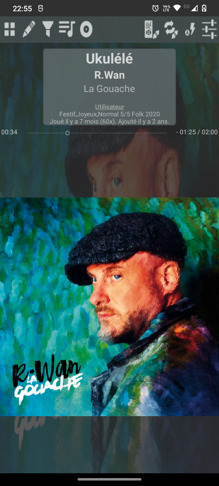
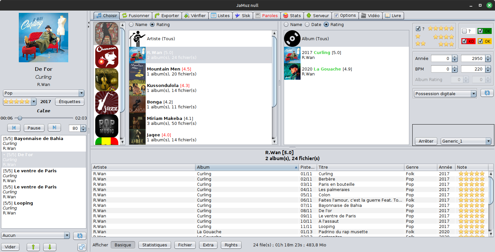

<!-- Slick Carousel CSS -->
<link rel="stylesheet" type="text/css" href="//cdn.jsdelivr.net/npm/slick-carousel@1.8.1/slick/slick.css"/>
<link rel="stylesheet" type="text/css" href="//cdn.jsdelivr.net/npm/slick-carousel@1.8.1/slick/slick-theme.css"/>

<!-- jQuery and Slick Carousel JS -->

<!-- Initialize Slick Carousel -->

|                         | JaMuz Android                                                                                                                                                                                                                                                                                                                                                                                                                                                                                                                 | JaMuz Desktop                                                                                                                 |
| ----------------------- | ----------------------------------------------------------------------------------------------------------------------------------------------------------------------------------------------------------------------------------------------------------------------------------------------------------------------------------------------------------------------------------------------------------------------------------------------------------------------------------------------------------------------------- | ----------------------------------------------------------------------------------------------------------------------------- |
| Platform(s)             |                                                                                                                                                                                                                                                                                                                                                                                                                                                                                |    |
| Overview                |                                                                                                                                                                                                                                                                                                                                                                                                                                                         |                                                                                                                        |
| Download & installation |  - [Get F-Droid](https://f-droid.org/F-Droid.apk) and [install it](https://www.androidauthority.com/how-to-install-apks-31494/). - Open F-Droid, search for `JaMuz` and install it.  OR  and [install it](https://www.androidauthority.com/how-to-install-apks-31494/), but you will not get updates! | -  - Extract 7z archive - Double-click on `JaMuz.jar`                |
| Available in            |                                                                                                                                                                                                                                                                                                                                                                                                             |                    |

``JaMuz Android`` and ``JaMuz Desktop`` can be used independently but it is recommended to use both together.

## JaMuz Android

- Audio Player:
  - Playlist editor (user tags, rating and genre)
  - Tag editor (user tags, rating and genre)
  - Replaygain support (MP3 only, FLAC on its way)
  - One finger control
  - Voice commands
- Merge your statistics with [JaMuz Desktop](https://github.com/phramusca/JaMuz)
  - And so with all players JaMuz Desktop can merge with (Mixxx, Kodi, guayadeque,...)
- Sync files from [JaMuz Desktop](https://github.com/phramusca/JaMuz) over WiFi
  - Select a playlist on JaMuz, connect JaMuz Remote sync, and wait for your files.
- Remote control for [JaMuz Desktop](https://github.com/phramusca/JaMuz)

## JaMuz Desktop

A **music** library **manager**, **player** and more, for **Linux**, **Raspberry** and **Windows**.

### Features

#### Sync data between audio players

**Sync** your tracks' **rating**, **custom tags**, **BPM**, **genre** and statistics (**last played**, **play counter** and **added date**) between JaMuz Desktop and your favorite players:

- [Guayadeque](https://doc.ubuntu-fr.org/guayadeque) (Linux)
- [Kodi](https://kodi.tv/) (Linux / Windows)
- [Media Monkey](https://www.mediamonkey.com/) (Windows)
- [Mixxx](https://mixxx.org/) (Linux / Windows)
- [JaMuz Android](https://github.com/phramusca/JaMuz-Remote)
- ... please [contribute](CONTRIBUTING.md) to add some more.

#### Sync files to devices

- Select a playlist and a destination (Phone, USB Key/HDD, MP3 player, ...).
- Process deletes unwanted files on destination then copy new files.

#### Sync with [JaMuz Android](https://github.com/phramusca/JaMuz-Remote)

- Using [JaMuz Android](https://github.com/phramusca/JaMuz-Remote), you can combine both above features, but **over WiFi**.
- You can also **remote control** JaMuz Desktop audio player.

#### Manage, Organize and Convert

- **Get** tracks **metadata** and **covers** from [MusicBrainz](https://musicbrainz.org/), [last.fm](https://www.last.fm/) and [Cover Art Archive](https://coverartarchive.org/).
- Detect **duplicates**.
- Compute **ReplayGain** (MP3 and FLAC).
- **Convert** files using [JAVE (Java Audio Video Encoder)](http://www.sauronsoftware.it/projects/jave/)
- **Rename** files and folders with tracks metadata and a mask (ex: "%albumartist%/%album%/%track% %title%").

#### And also

- Create complex **playlists** in a simple way.
- Audio **player** (using mplayer).
- Library statistics with graphs.
- Lyrics display.
- Runs on **Windows, Raspberry and Linux** (as written in Java), maybe Mac OS (not tested).
- Bonus:
  - Kodi helper to manage your videos.
  - Calibre helper to manage your ebooks.

## Donate

I'll always be pleased if you offer me a beer (or a cup of tea, or more) to support my contribution :)

